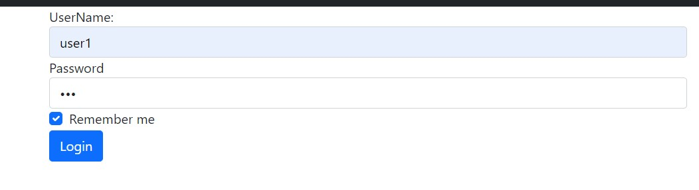
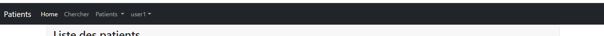
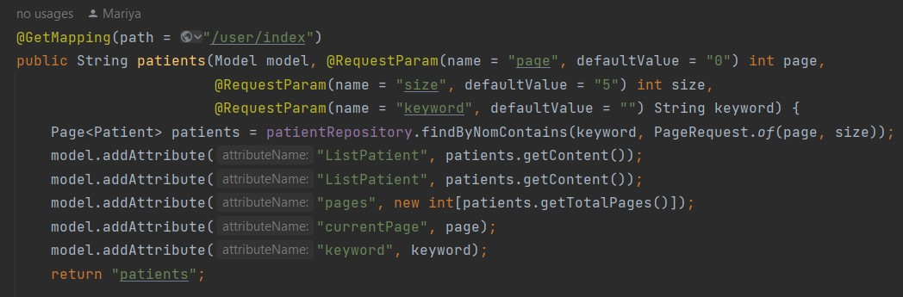
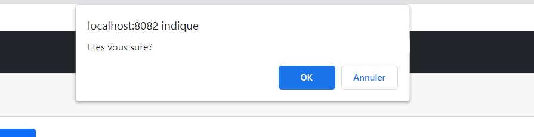
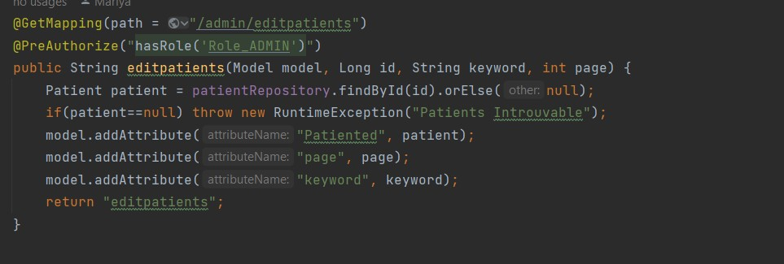

<h3> Compte rendu </h3>
<h5>Login interface :</h5>

<h5>username in navbar thymleaf authentication  </h5>

<h5>user interface : with minimal acess </h5>

<h5>admin interface : with delete edit add options </h5>

<h5>fonction index PatientController: </h5>

<h5>delete function: </h5>

<h5>delete in interface confirm message  </h5>

<h5>edit function  </h5>

